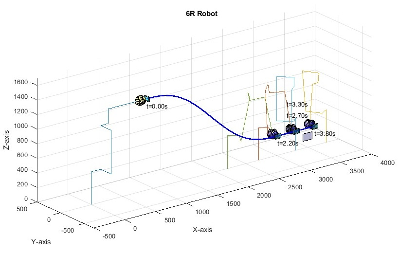
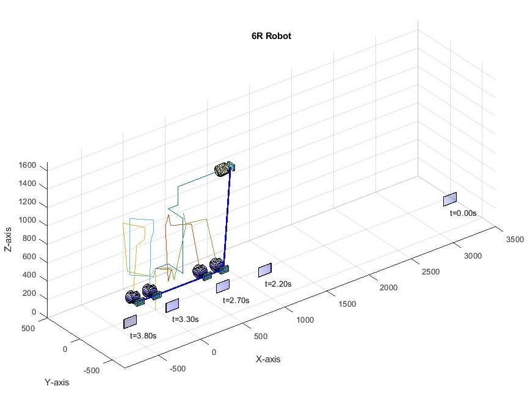
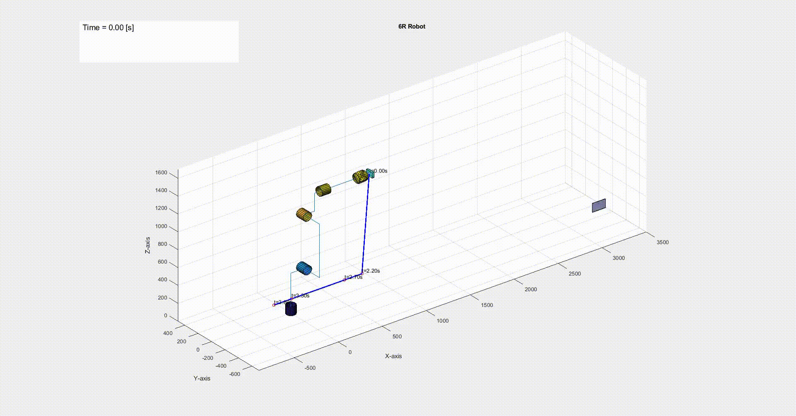

# Scanning Robotic Arm Project (In Nuclear Waste Storage)

## Project Overview
This project focuses on a 6R serial robotic arm (FANUC model M-10iA) mounted on a rail, designed to scan barcodes of nuclear waste storage containers in a storage corridor.

## Repository Contents

### Documentation
- `ProjectEnglishVR.pdf`: Comprehensive project report in English
- `PDF_Project_Code.pdf`: Detailed code documentation
- `README.md`: Project overview and repository guide

### Code
- `Project_Code.m`: MATLAB implementation of the robotic arm trajectory and analysis

### Visualizations
- `Combined_Abs.jpg`: Absolute motion plot (relative to initial ground position)
- `Combined_Rel.jpg`: Relative motion plot (relative to the moving robot base)

### Motion Demonstration Videos
- `my_video_abs.mp4`: Absolute motion video (relative to initial ground position)
- `my_video_rel.mp4`: Relative motion video (relative to the moving robot base)

## Motion Visualization - Images and Videos

### Absolute Movement
**Plot:**

**Video Demonstration:**

### Relative Movement
**Plot:**

**Video Demonstration:**

### Visualization Details
- Both plots and videos show the robot's motion with a time step of dt = 0.01 [sec]
- Demonstrates precise trajectory and barcode scanning motion
- Videos provide continuous motion representation

## Key Specifications
- Robot: 6R Serial Robot (FANUC M-10iA)
- Mounting: Fixed on a rail in a nuclear waste storage corridor
- Scanner: Camera mounted on robot end-effector
- Container Details:
  - Distance between containers: 50 cm
  - Container diameter: 60 cm
  - Barcode location: 80 cm from floor

## Project Objectives
1. Determine optimal robot positioning and base height
2. Calculate robot's:
   - Forward Kinematics
   - Inverse Kinematics
   - Full Jacobian
3. Identify singularity points in linear velocity Jacobian
4. Design a joint-space trajectory for barcode scanning
5. Ensure precise barcode scanning with specific constraints

## Scanning Constraints
- Camera must be perpendicular to the container
- Zero relative velocity required for at least 0.5 seconds
- Scanning distance: 20-30 cm from container
- Specific orientation alignment

## Trajectory Planning
The robot's movement is divided into three primary stages:
1. Start from zero position (Position A)
2. Move to scanning position (Position B)
3. Barcode scanning trajectory (Position C):
   - 0.5s acceleration to scanning velocity
   - 0.6s constant velocity scanning
   - 0.5s deceleration to stop

## Assumptions
- Negligible camera and end-effector weight
- Minimal dynamic forces
- Consistent camera and last link orientation
- Starting from robot's specified zero position

## Challenges
- Precise trajectory planning
- Meeting strict scanning velocity and orientation requirements
- Managing potential singularity points

## Technologies Used
- Robotics kinematics
- Trajectory planning
- Barcode scanning
- MATLAB/Simulink (presumed from code extension)

## Team
Alon and project team (Technion Robotics Course)
